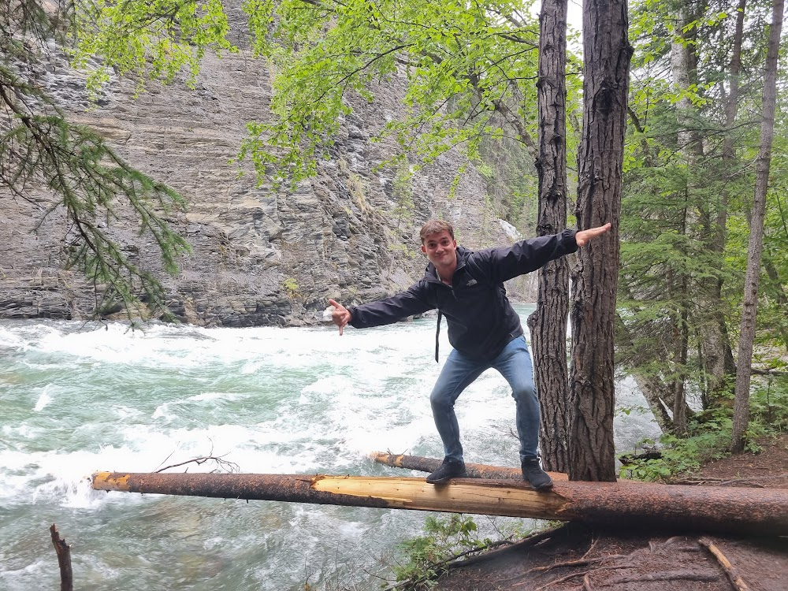

 

Mijn naam is Max Strootmann, ik ben 28 jaar oud en heb al 10 jaar ervaring als monteur in de werktuigbouw, waarvan de laatste 3 jaar als zzp'er. In die 10 jaar heb ik met veel verschillende bedrijven gewerkt, zowel in de werkplaats als in de buitendienst, assemblage en service.

In oktober 2022 brak ik mijn schouder en moest ik een half jaar thuis blijven. In die periode ben ik begonnen met het maken van websites. Al snel groeide mijn interesse voor het programmeren en het ontwikkelen van systemen, waardoor ik besloot mezelf om te scholen tot softwareontwikkelaar. Ik werk nu nog maar drie dagen per week als monteur en besteed de rest van de tijd aan [[mijn studie]].

Naast mijn studie werk ik aan een nieuwe onderneming, KMA Techniek & IT (Kennis Met AI). Hierbij combineer ik mijn kennis van IT en mijn ervaring in de techniek om bedrijven in de techniek sector te helpen met intern kennisbeheer.