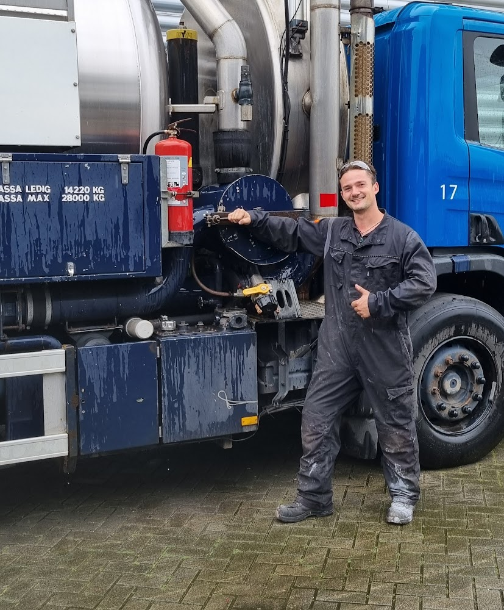

Technische documentatie schrijven is moeilijk, vooral als je schrijft over werk dat je zelf nog nooit hebt gedaan.

Om te kunnen helpen met het opzetten van een kennisbeheersysteem, moet ik goed weten wat het werk inhoud, hoe de monteurs werken, en hoe zij nu aan hun informatie komen. Daarom stel ik voor om eerst (minimaal) een maand bij jullie te komen werken als zzp monteur. In die eerste periode heb ik de kans om alle collega's te leren kennen, en om het inwerkproces te ervaren. 
 